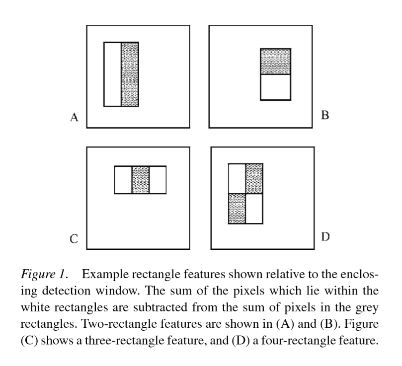
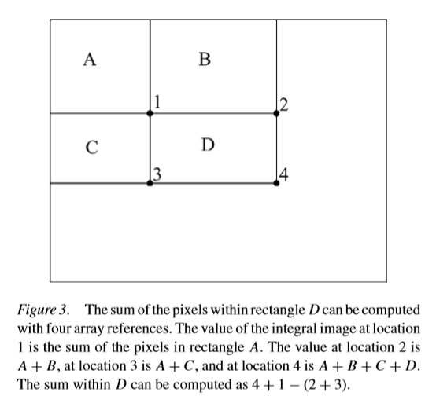
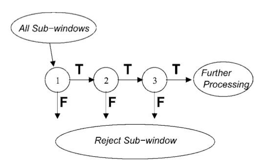

# Viola-Jones Detection Framework

This is an implement of Viola-Jones Detection Framework and is used in human face detection.

## Requirements

This implement of Viola-Jones Framework require python version 3.5.2, and depends on the following modules:

|module|version|comment|
|:--|:--|:--|
numpy|1.13.3|
scipy|1.0.0|
opencv-python|3.4.0.14|for capturing image
scikit-learn|0.19.1|for shuffling data

## Usage

Run the following command to begin face detection:

```bash
python detect.py
```

## Main Concepts

### Haar-like Features

Haar-like features are proposed by Viola and Jones, adapting the idea (from Papageoriou et al) of using Haar wavelets.



In this implement, five types of Haar-like features are used. They are: left-right, top-bottom, horizontal-middle, vertical-middle, diagonal.


### Integral Image

To speed up features extraction process, an intermediate representation for the image called integral image is used.



### AdaBoost

AdaBoost is short for Adaptive Boosting, which is a kind of method of ensemble learning.

For more info about AdaBoost, refers to [GitHub - Donny-Hikari/AdaBoost](https://github.com/Donny-Hikari/AdaBoost)

### BoostedCascade

To speed up detection process, as well as to decrease the false positive rate while sustaining a high detection rate (i.e. to improve precision), Viola and Jones invent the boosted cascade. That is, to cascade multiple AdaBoost classifiers.



## References

1. Yoav Freund; Robert E. Schapire. AT&T Labs – Research, Shannon Laboratory. Journal of Japanese Society for Artificial Intelligence,14(5):771-780, September 1999. A Short Introduction to Boosting.

2. Paul Viola; Michael J. Jones. IEEE Computer Society Conference on Computer Vision and Pattern Recognition, May 2004. Rapid Object Detection Using a Boosted Cascade of Simple Features.

3. Paul Viola; Michael J. Jones. International Journal of Computer Vision 57(2), 137–154, 2004. Robust Real-Time Face Detection. 

## Author

||
|:--:|
| [](https://github.com/Donny-Hikari) |
| [Donny Hikari](https://github.com/Donny-Hikari) |
